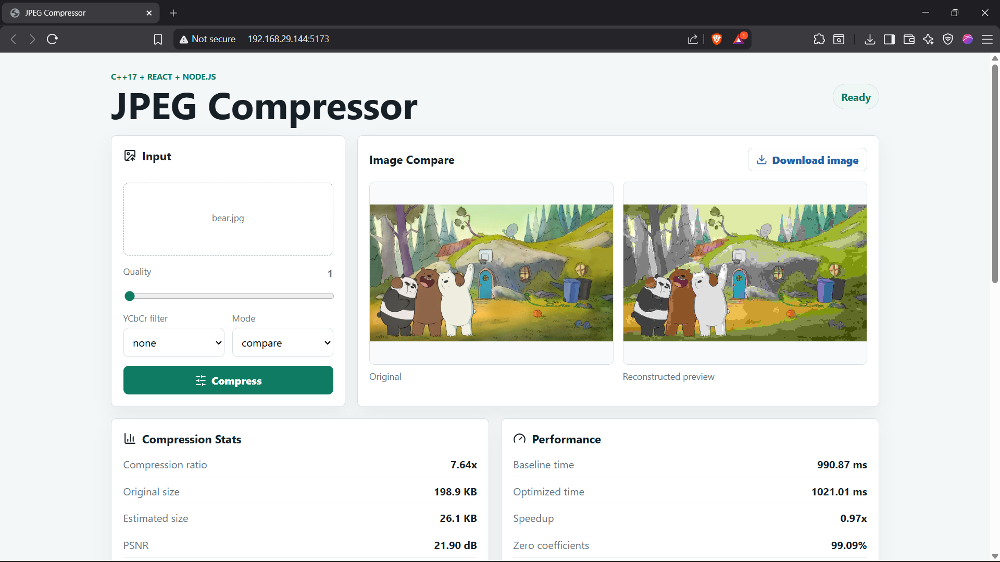
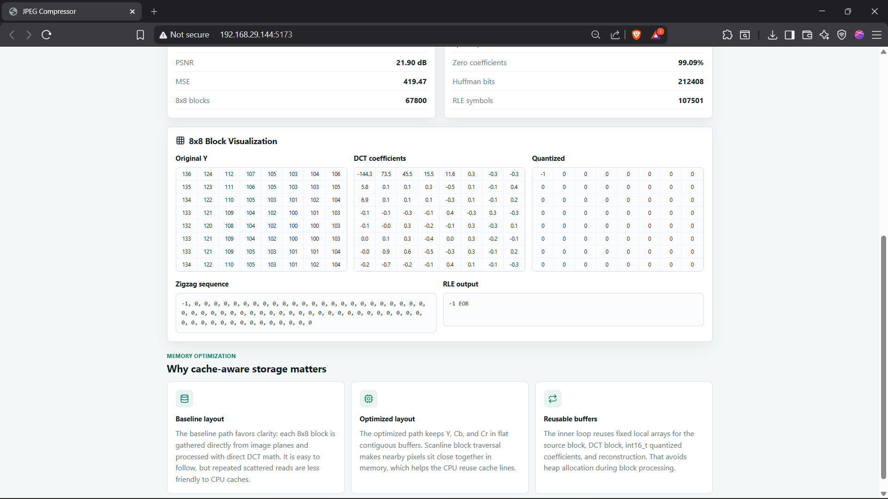
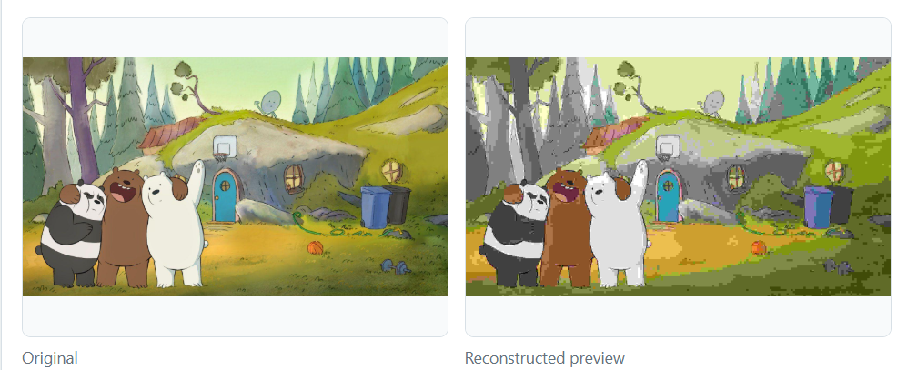
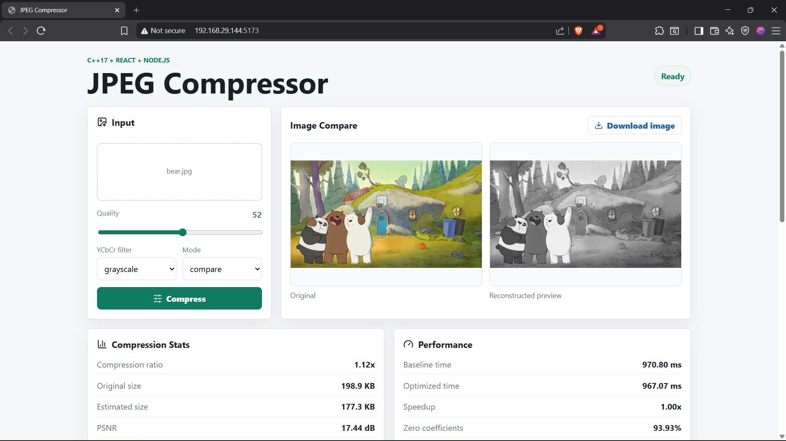

## Contributors

- Nitish Kalra (2024MCB1307)
- Guransh Singh (2024CSB1118)
- Aryan Sandal (2024CSB1103)

# JPEG Compressor

A small full-stack project for experimenting with the main ideas behind JPEG-style image compression. This lets you upload an image, choose a quality value and filter, then compare the original image with a reconstructed compressed preview.

This is not a real `.jpg` encoder. It does not write a valid JPEG bitstream. The goal is to show the compression pipeline manually and report useful statistics like MSE, PSNR, zero coefficients, RLE symbols, Huffman bit estimate, and runtime.

## Tech Stack

- C++17
- CMake
- stb_image / stb_image_write
- Node.js
- Express
- Multer
- Sharp
- React
- Vite

## Screenshots

### Compressing image to max extent



---

### Data Tables



---

### Enlarged View



---

### Filters (Grayscale potrayed)




## Features

- Upload an image from the browser
- Select quality from 1 to 100
- Apply YCbCr filters: `none`, `grayscale`, `warm`, `cool`, `vintage`, `contrast`, `saturation`
- Run in `baseline`, `optimized`, or `compare` mode
- Show original image and reconstructed output image
- Show compression ratio, estimated compressed size, MSE, PSNR, runtime, block count, zero coefficient percentage, RLE symbol count, and Huffman bit estimate
- Show one 8x8 block view with original Y values, DCT coefficients, quantized values, zigzag order, and RLE output
- Download the reconstructed output image

## Folder Structure

```text
cpp-compressor/   C++ compressor and CMake build file
backend/          Express server that accepts uploads and runs the C++ program
frontend/         React + Vite website
```

## How It Works

```text
React frontend
  -> sends image and settings to POST /api/compress
Express backend
  -> receives upload
  -> converts upload to BMP input for the C++ program
  -> runs jpeg_compressor
C++ compressor
  -> loads image
  -> runs JPEG-style compression steps
  -> writes reconstructed PNG and stats JSON
Express backend
  -> returns image URL and stats to the frontend
React frontend
  -> displays output image and numbers
```

## Compression Pipeline

The C++ compressor does these steps:

1. Load RGB image using `stb_image`
2. Convert RGB to YCbCr
3. Apply the selected YCbCr filter
4. Process Y, Cb, and Cr channels in padded 8x8 blocks
5. Apply DCT
6. Quantize using a quality-scaled luminance matrix
7. Zigzag scan the 8x8 coefficients
8. Run-length encode zeros
9. Estimate Huffman bit count from RLE symbol frequencies
10. Dequantize and run inverse DCT
11. Convert reconstructed YCbCr back to RGB
12. Save reconstructed image using `stb_image_write`
13. Write stats JSON manually

## Baseline vs Optimized Mode

The baseline mode is written in a simple way so the pipeline is easy to follow.

The optimized mode uses flat channel buffers and reusable local arrays inside the block loop:

```cpp
vector<float> y(width * height);
vector<float> cb(width * height);
vector<float> cr(width * height);

float block[64];
float dctBlock[64];
int16_t qBlock[64];
```

The idea is to avoid repeated heap allocation and keep image data in contiguous memory so block traversal is more cache-friendly.

## Run Locally On Windows

Open the project folder in VS Code and use three terminals.

### 1. Build the C++ compressor

```powershell
cd cpp-compressor
cmake -S . -B build
cmake --build build --config Release
```

Expected output:

```text
cpp-compressor/build/Release/jpeg_compressor.exe
```

### 2. Start the backend

```powershell
cd backend
npm install
npm start
```

Backend runs at:

```text
http://localhost:5000
```

### 3. Start the frontend

```powershell
cd frontend
npm install
npm run dev
```

Frontend runs at:

```text
http://localhost:5173
```

## Direct C++ Usage

After building, the compressor can also be run directly:

```powershell
.\cpp-compressor\build\Release\jpeg_compressor.exe input_image output_image stats_json --quality 50 --filter warm --mode optimized
```

Example:

```powershell
.\cpp-compressor\build\Release\jpeg_compressor.exe .\backend\uploads\input.bmp .\backend\outputs\out.png .\backend\outputs\stats.json --quality 50 --filter warm --mode compare
```

## Notes
- The compression logic is implemented manually in C++ and does not use libjpeg or OpenCV compression.

## Possible Improvements

- Real JPEG bitstream writer
- Faster DCT implementation
- WebAssembly version to run the compressor fully in the browser
